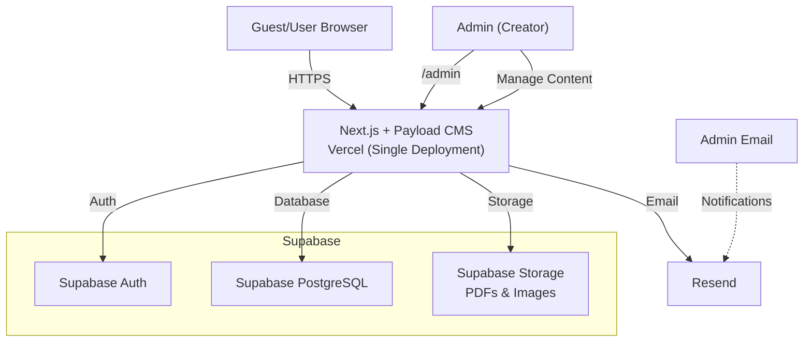
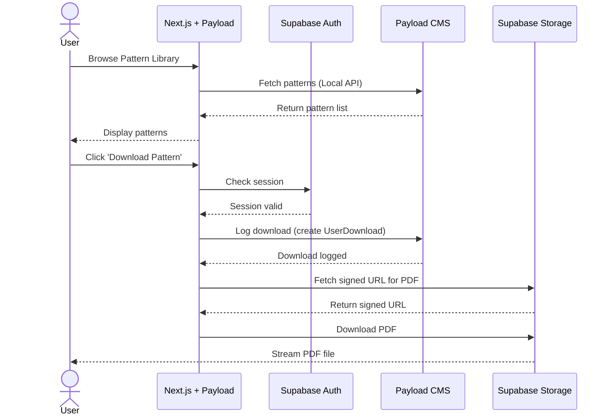
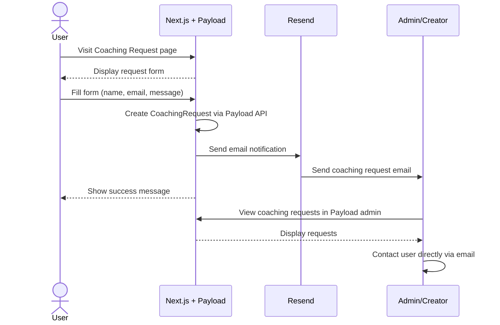

# ARCHITECTURE.md: Nurea Knit

## System Overview

Nurea Knit is a personal brand website built on a modern, integrated architecture. The entire system runs as a single Next.js application on Vercel, with Payload CMS embedded directly inside the Next.js codebase. Supabase provides the PostgreSQL database, authentication, and file storage. This unified architecture simplifies deployment, reduces operational complexity, and keeps the entire system manageable for a solo developer.

## High-Level Architecture Diagram

## Component Breakdown

### Next.js + Payload CMS (Vercel — Single Deployment)

**Responsibilities:**
- Render all public pages (Homepage, Blog, Portfolio, About, Pattern Library, Product Showcase, Coaching Request).
- Run Payload CMS admin panel at `/admin` route for content management.
- Provide user profile page for authenticated users (downloads, wishlist, settings).
- Implement client-side authentication flow via Supabase Auth.
- Optimize for SEO via SSG (static generation) and ISR (incremental static regeneration).
- Serve responsive, accessible UI aligned with the artisanal visual brand.
- Handle API routes for app-specific operations (download, wishlist, coaching).

**Key Features:**
- Payload CMS embedded as a dependency — no separate backend server.
- Static generation for high-traffic pages (Homepage, Pattern Library, Shop catalog).
- Image optimization and lazy loading for performance.
- User authentication via Supabase Auth for pattern downloads and wishlist.

### Payload CMS (Embedded)

**Responsibilities:**
- Provide a unified admin interface for the creator to manage all content.
- Expose content via REST and GraphQL APIs consumed by Next.js server components.
- Manage file uploads (pattern PDFs, product images, portfolio images).
- Handle rich text editing for blog posts and pages.
- Provide role-based access control (only the creator/admin can modify content).

**Key Features:**
- Custom collections for Patterns, Blog Posts, Portfolio Items, Products, Pages, and more.
- Built-in media management with Supabase Storage integration.
- Rich text editor for blog content.
- Local API for direct server-side queries without HTTP calls.

### Supabase Auth (Authentication Layer)

**Responsibilities:**
- Manage user registration and login via email/password.
- Secure session management with automatic token refresh.
- Protect download and wishlist endpoints.
- Provide client and server SDK for auth state management.

**Key Features:**
- Email/password authentication (no OAuth required for V1).
- Secure password hashing (automatic via Supabase).
- Session persistence across page reloads via HTTP-only cookies.
- Automatic token refresh and expiration handling.
- Row-level security (RLS) policies for direct database access.

### Supabase (PostgreSQL Database + Storage)

**Responsibilities:**
- Store all application data managed by Payload CMS collections.
- Provide secure file storage for pattern PDFs and product images.
- Manage auth users table and session data.

**Key Features:**
- Managed PostgreSQL with automatic backups and replication.
- Row-level security (RLS) policies to enforce data access rules.
- Integrated file storage with signed URLs for secure PDF/image delivery.

### Email Service (Resend)

**Responsibilities:**
- Send coaching request notifications to the admin.

**Key Features:**
- Simple API for transactional emails.

## Data Flow: Pattern Download

## Data Flow: Offline Coaching

## Deployment Strategy

### Frontend + CMS (Next.js + Payload) — Vercel

- **Hosting:** Vercel (serverless platform optimized for Next.js).
- **Deployment:** Automatic CI/CD on git push to main branch.
- **Environment:** Single production environment with custom domain.
- **Performance:** Global CDN for static assets and edge caching.
- **Database:** Payload connects to Supabase PostgreSQL.
- **File Storage:** Payload uploads/retrieves files from Supabase Storage.
- **Monitoring:** Built-in analytics and error tracking via Vercel dashboard.

### Database (Supabase PostgreSQL)

- **Hosting:** Supabase managed PostgreSQL (cloud-hosted).
- **Backups:** Automatic daily backups with 7-day retention.
- **Access:** Restricted to Next.js/Payload via connection string.
- **Security:** Row-level security (RLS) policies enforce data access rules.

### File Storage (Supabase Storage)

- **Hosting:** Supabase Storage (S3-compatible object storage).
- **Access:** Uploads handled via Payload CMS; signed URLs for secure download.
- **CDN:** Supabase Storage includes CDN for fast global delivery.

## Data Model Overview

### Payload Collections

All data is managed through Payload CMS collections rather than raw Prisma models. The key collections are:

**Users** (managed by Supabase Auth, referenced by Payload)
- id (UUID)
- email (unique)
- name
- created_at

**Patterns** (Payload collection)
- id, title, slug, description, difficulty (enum), craftType (enum)
- pdf (upload), thumbnail (upload)
- createdAt, updatedAt

**Blog Posts** (Payload collection)
- id, title, slug, content (rich text), excerpt, featuredImage (upload)
- publishedAt, createdAt, updatedAt

**Products** (Payload collection)
- id, name, slug, description, images (uploads), externalLink
- createdAt, updatedAt

**Portfolio Items** (Payload collection)
- id, title, description, images (uploads), techniques, category
- createdAt, updatedAt

**Coaching Requests** (Payload collection)
- id, name, email, message, status (enum: new/contacted/archived)
- createdAt, updatedAt

**User Downloads** (Payload collection)
- user (relationship), pattern (relationship), downloadedAt

**Wishlist Items** (Payload collection)
- user (relationship), product (relationship), createdAt

**Pages** (Payload collection)
- id, title, slug, content (rich text), publishedAt

## API Integration Points

### Next.js API Routes (Custom)
- `POST /api/patterns/[id]/download` — Log download, return signed PDF URL
- `GET/POST/DELETE /api/wishlist` — Wishlist CRUD
- `POST /api/coaching` — Submit coaching request, email admin

### Payload REST API (Auto-generated, authenticated)
- `GET /api/patterns` — Fetch all patterns with filters
- `GET /api/patterns/:id` — Fetch single pattern
- `GET /api/posts` — Fetch blog posts
- `GET /api/products` — Fetch products
- `GET /api/portfolio` — Fetch portfolio items

### Supabase Auth API
- `signUp()` — Register new user
- `signInWithPassword()` — Login
- `signOut()` — Logout
- `getSession()` / `getUser()` — Session management

## Security Considerations

- **HTTPS/TLS:** All traffic encrypted in transit (enforced by Vercel).
- **Authentication:** Managed by Supabase Auth with automatic password hashing and session management.
- **Authorization:** Payload CMS access control for admin; RLS policies in Supabase.
- **File Access:** Signed URLs with expiration time limit access to PDFs.
- **Admin Access:** Payload admin panel protected by email/password; accessible only to the creator.
- **Environment Variables:** Sensitive keys stored securely in Vercel environment.

## Performance Optimization

- **Frontend:** Next.js SSG for static pages, ISR for content updates, image optimization, code splitting.
- **CMS:** Payload caching layer, database query optimization, indexed fields.
- **Storage:** Supabase CDN for fast file delivery.

## Scalability Path

- **Phase 1 (Current):** Single admin, static content, user accounts for downloads.
- **Phase 2 (Future):** Email automation, advanced analytics dashboard.
- **Phase 3 (Future):** Newsletter, advanced SEO tooling.
- **Phase 4 (Future):** Multi-language support, advanced personalization.

The architecture is designed to remain simple and maintainable while allowing incremental feature additions without major refactoring.
