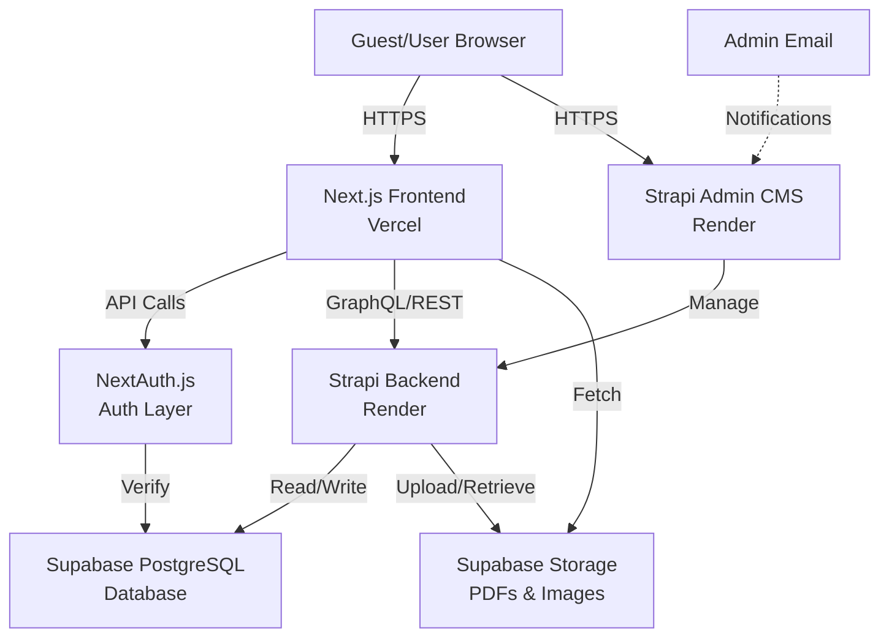
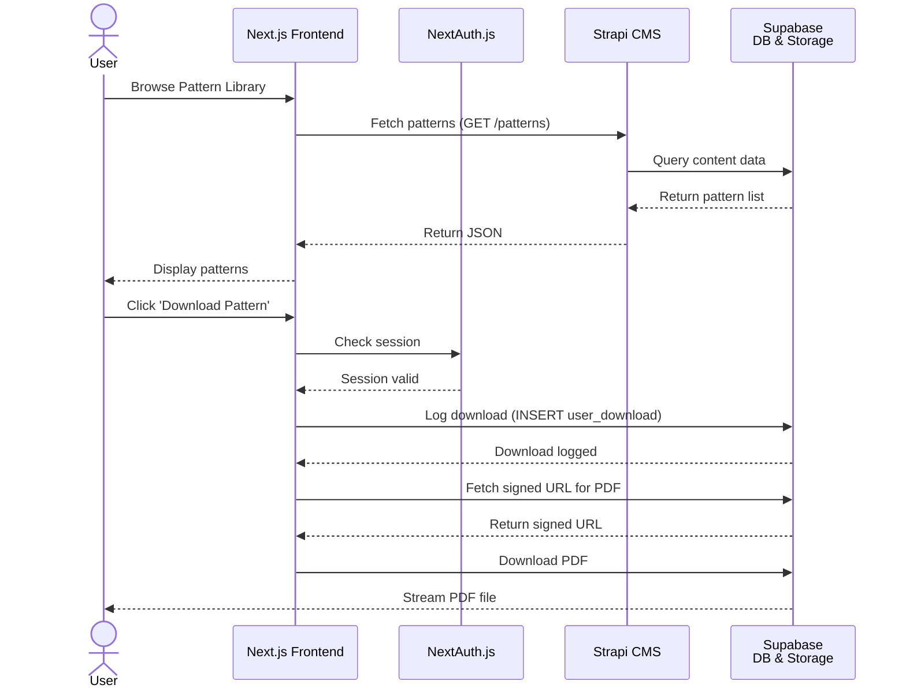
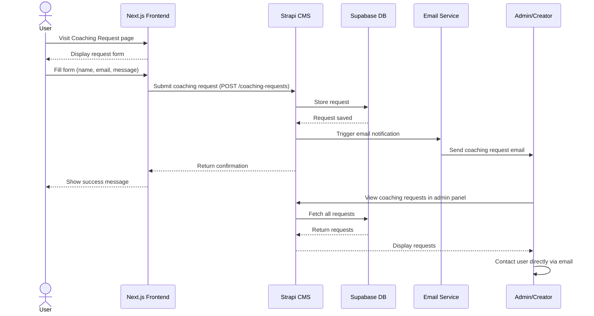

# ARCHITECTURE.md: Nureaknite

## System Overview

Nureaknite is a personal brand website built on a modern, decoupled architecture. The frontend (Next.js) serves as a fast, SEO-optimized presentation layer for content consumption and product showcase. The backend (Strapi headless CMS) provides a flexible content management interface for the creator to manage patterns, blog posts, portfolio items, and shop products without technical overhead. Authentication (NextAuth.js) secures user accounts for pattern downloads and wishlists. This architecture prioritizes simplicity, performance, and the personal brand experience while remaining scalable for future growth.

## High-Level Architecture Diagram

## Component Breakdown

### Next.js Frontend (Vercel)

**Responsibilities:**
- Render public pages (Homepage, Blog, Portfolio, About, Pattern Library, Product Showcase, Coaching Request).
- Provide user profile page for authenticated users to view downloads, wishlist, and account settings.
- Implement client-side authentication flow via NextAuth.js.
- Optimize for SEO via SSG (static generation) and ISR (incremental static regeneration).
- Serve responsive, accessible UI aligned with the cozy, artisanal visual brand.

**Key Features:**
- Static generation for high-traffic pages (Homepage, Pattern Library, Shop catalog).
- Image optimization and lazy loading for performance.
- User authentication for pattern downloads and wishlist.

### Strapi Headless CMS (Render)

**Responsibilities:**
- Provide a unified admin interface for the creator to manage all content: Patterns, Blog Posts, Portfolio Items, and Shop Products.
- Expose content via REST and GraphQL APIs consumed by the Next.js frontend.
- Store metadata for all content types (title, description, difficulty, etc.).
- Manage file uploads (pattern PDFs, product images, portfolio images).
- Provide role-based access control (only the creator/admin can modify content).

**Key Features:**
- Custom content types for Patterns, Blog Posts, Portfolio Items, and Products.
- Built-in media library for image and PDF management.
- Flexible field types (text, rich text, number, select, relation).

### NextAuth.js Authentication Layer

**Responsibilities:**
- Manage user registration and login via email/password.
- Secure session management and JWT token handling.
- Protect download and wishlist endpoints.
- Integrate with Supabase as the user database provider.

**Key Features:**
- Email/password authentication (no OAuth required for V1).
- Secure password hashing via bcrypt.
- Session persistence across page reloads.
- Automatic token refresh and expiration handling.

### Supabase (PostgreSQL Database + Storage)

**Responsibilities:**
- Store all application data: users, download history, wishlist items, coaching requests.
- Provide secure file storage for pattern PDFs and product images.
- Manage authentication provider integration (users table).

**Key Features:**
- Managed PostgreSQL with automatic backups and replication.
- Row-level security (RLS) policies to enforce data access rules.
- Integrated file storage with signed URLs for secure PDF/image delivery.

### Email Service (Resend)

**Responsibilities:**
- Send coaching request notifications to the admin.
- Send password reset emails.
- Send pattern download confirmation emails (optional).

**Key Features:**
- Simple API for transactional emails.
- Email templates for coaching notifications.

## Critical Flow Sequence Diagram

### Pattern Download Flow

### Offline Coaching Request Flow

## Deployment Strategy

### Frontend (Next.js) — Vercel

- **Hosting:** Vercel (serverless platform optimized for Next.js).
- **Deployment:** Automatic CI/CD on git push to main branch.
- **Environment:** Production environment with custom domain (nureaknite.com).
- **Performance:** Global CDN for static assets and edge caching.
- **Monitoring:** Built-in analytics and error tracking via Vercel dashboard.

### Backend CMS (Strapi) — Render

- **Hosting:** Render (managed Node.js hosting).
- **Deployment:** Automatic deployment on git push.
- **Environment:** Environment variables for API keys and database credentials.
- **Database Connection:** Strapi connects to Supabase PostgreSQL via connection string.
- **File Storage:** Strapi uploads/retrieves files from Supabase Storage.
- **Monitoring:** Render provides logs and error tracking.

### Database (Supabase PostgreSQL)

- **Hosting:** Supabase managed PostgreSQL (cloud-hosted).
- **Backups:** Automatic daily backups with 7-day retention.
- **Access:** Restricted to Strapi backend and NextAuth.js via connection strings and API keys.
- **Security:** Row-level security (RLS) policies enforce data access rules.

### File Storage (Supabase Storage)

- **Hosting:** Supabase Storage (S3-compatible object storage).
- **Access:** Signed URLs for secure, time-limited access to PDFs and images.
- **CDN:** Supabase Storage includes CDN for fast global delivery.

### Email Service

- **Provider:** Resend (or SendGrid as alternative).
- **Use Cases:** Coaching request notifications, password reset emails.
- **Configuration:** Environment variables for API keys.

## Data Model Overview

### Core Entities

**Users**
- id (UUID, primary key)
- email (string, unique)
- password_hash (string, bcrypt)
- name (string)
- created_at (timestamp)
- updated_at (timestamp)

**Patterns**
- id (UUID, primary key)
- title (string)
- description (text)
- difficulty (enum: Beginner, Intermediate, Advanced)
- craft_type (enum: Knitting, Crochet)
- pdf_file_path (string, reference to Supabase Storage)
- created_at (timestamp)
- updated_at (timestamp)

**Products** (Shop Showcase)
- id (UUID, primary key)
- name (string)
- description (text)
- external_link (string, optional)
- image_path (string, reference to Supabase Storage)
- created_at (timestamp)
- updated_at (timestamp)

**Coaching Requests**
- id (UUID, primary key)
- name (string)
- email (string)
- message (text)
- status (enum: New, Contacted, Archived)
- created_at (timestamp)
- updated_at (timestamp)

**Blog Posts**
- id (UUID, primary key)
- title (string)
- slug (string, unique)
- content (rich text)
- excerpt (text)
- featured_image_path (string, reference to Supabase Storage)
- published_at (timestamp, nullable)
- created_at (timestamp)
- updated_at (timestamp)

**Portfolio Items**
- id (UUID, primary key)
- title (string)
- description (text)
- image_path (string, reference to Supabase Storage)
- created_at (timestamp)
- updated_at (timestamp)

**User Downloads**
- user_id (UUID, foreign key)
- pattern_id (UUID, foreign key)
- downloaded_at (timestamp)

**Wishlist Items**
- id (UUID, primary key)
- user_id (UUID, foreign key)
- product_id (string)
- created_at (timestamp)

## API Integration Points

### Strapi REST/GraphQL API

- **GET /api/patterns** — Fetch all patterns with filters (difficulty, craft_type).
- **GET /api/patterns/:id** — Fetch single pattern details.
- **GET /api/products** — Fetch all shop products.
- **GET /api/blog** — Fetch blog posts with pagination.
- **GET /api/portfolio** — Fetch portfolio items.
- **POST /api/coaching-requests** — Submit coaching request form.

### Supabase API

- **Auth endpoints** — User registration, login, password reset (via NextAuth.js).
- **Database queries** — CRUD operations on user data (via Next.js API routes).
- **Storage endpoints** — Retrieve files with signed URLs.

## Security Considerations

- **HTTPS/TLS:** All traffic encrypted in transit (enforced by Vercel and Render).
- **Authentication:** Passwords hashed with bcrypt; sessions managed via NextAuth.js JWT tokens.
- **Authorization:** Row-level security (RLS) policies in Supabase enforce user-specific data access.
- **File Access:** Signed URLs with expiration time limit access to PDFs and images.
- **Admin Access:** Strapi admin panel protected by email/password; accessible only to the creator.
- **Environment Variables:** Sensitive keys stored securely in hosting platform environment.

## Performance Optimization

- **Frontend:** Next.js SSG for static pages, ISR for content updates, image optimization, code splitting.
- **Backend:** Strapi caching layer, database query optimization, indexed fields for common filters.
- **Storage:** Supabase CDN for fast file delivery; signed URLs cached client-side.

## Scalability Path

- **Phase 1 (Current):** Single admin, static content, user accounts for downloads.
- **Phase 2 (Future):** Email automation, advanced analytics dashboard.
- **Phase 3 (Future):** Subscription model, affiliate/referral system.
- **Phase 4 (Future):** Multi-language support, advanced personalization.

The architecture is designed to remain simple and maintainable while allowing incremental feature additions without major refactoring.
