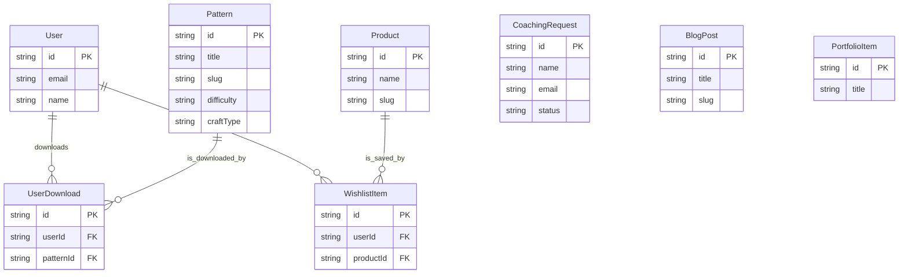

# DATABASE.md: Nurea Knit

This document outlines the database architecture for the Nurea Knit project. The database is hosted on Supabase PostgreSQL. Data is managed through Payload CMS collections rather than a traditional ORM like Prisma.

## Architecture Overview

Nurea Knit uses a **single PostgreSQL database** on Supabase for all data. The database is accessed through two paths:

1. **Payload CMS** — Manages all content collections (Patterns, Blog Posts, Products, Portfolio, Coaching Requests, Pages, Media, User Downloads, Wishlist Items).
2. **Supabase Auth** — Manages user accounts and authentication.

No raw Prisma schema or manual migrations are needed — Payload CMS handles schema migrations automatically, and Supabase Auth manages its own auth schema.

## Payload Collections (Managed by Payload CMS)

### Users
Users are managed by Supabase Auth. Payload can reference users via a relationship field.

| Field | Type | Description |
|:---|:---|:---|
| `id` | UUID (PK) | Unique identifier (managed by Supabase Auth) |
| `email` | String (UK) | User's email address |
| `name` | String | User's display name |

### Patterns
Represents a digital knitting or crochet pattern (PDF). All patterns are free.

| Field | Type | Description |
|:---|:---|:---|
| `id` | Text (PK) | Unique identifier |
| `title` | Text | Title of the pattern |
| `slug` | Text (UK) | URL-friendly unique identifier |
| `description` | RichText | Detailed description of the pattern |
| `difficulty` | Select | Difficulty level: `beginner`, `intermediate`, `advanced` |
| `craftType` | Select | Type of craft: `knitting`, `crochet`, `both` |
| `pdf` | Upload | Pattern PDF file (stored in Supabase Storage) |
| `thumbnail` | Upload | Pattern thumbnail image |
| `yarnWeight` | Text | Recommended yarn weight |
| `estimatedTime` | Text | Estimated completion time |
| `materials` | Text | Recommended supplies |
| `tags` | Array | Tags for filtering |
| `createdAt` | Date | Timestamp when created |
| `updatedAt` | Date | Timestamp of last update |

### Blog Posts
Stores content for blog articles and tutorials.

| Field | Type | Description |
|:---|:---|:---|
| `id` | Text (PK) | Unique identifier |
| `title` | Text | Title of the blog post |
| `slug` | Text (UK) | URL-friendly unique identifier |
| `content` | RichText | Full content of the blog post |
| `excerpt` | Text | Short summary for previews |
| `featuredImage` | Upload | Hero image for the post |
| `category` | Select | Category: `tutorial`, `design`, `material`, `trend`, `spotlight` |
| `tags` | Array | Tags for filtering |
| `publishedAt` | Date | Timestamp when published (nullable for drafts) |
| `createdAt` | Date | Timestamp when created |
| `updatedAt` | Date | Timestamp of last update |

### Products
Represents physical products showcased in the shop catalog (no purchase flow).

| Field | Type | Description |
|:---|:---|:---|
| `id` | Text (PK) | Unique identifier |
| `name` | Text | Name of the product |
| `slug` | Text (UK) | URL-friendly unique identifier |
| `description` | RichText | Detailed description |
| `images` | Array of Uploads | Product images (multiple) |
| `externalLink` | Text | Optional link to external purchase page |
| `createdAt` | Date | Timestamp when created |
| `updatedAt` | Date | Timestamp of last update |

### Portfolio Items
Showcases the creator's finished works or projects.

| Field | Type | Description |
|:---|:---|:---|
| `id` | Text (PK) | Unique identifier |
| `title` | Text | Title of the portfolio piece |
| `description` | RichText | Project narrative and inspiration |
| `category` | Select | Category: `garments`, `accessories`, `home-decor`, `experimental` |
| `craftType` | Select | `knitting`, `crochet`, `both` |
| `difficulty` | Select | `beginner`, `intermediate`, `advanced` |
| `images` | Array of Uploads | Multiple high-quality photos |
| `techniques` | Array | Techniques used |
| `completionDate` | Date | When the project was finished |
| `createdAt` | Date | Timestamp when created |
| `updatedAt` | Date | Timestamp of last update |

### Coaching Requests
Stores details from the one-on-one offline coaching request form.

| Field | Type | Description |
|:---|:---|:---|
| `id` | Text (PK) | Unique identifier |
| `name` | Text | Name of the person requesting coaching |
| `email` | Text | Email address of the requester |
| `message` | TextArea | Message or specific request |
| `status` | Select | Status: `new`, `contacted`, `archived` |
| `createdAt` | Date | Timestamp when submitted |
| `updatedAt` | Date | Timestamp of last update |

### User Downloads
Tracks which patterns a user has downloaded.

| Field | Type | Description |
|:---|:---|:---|
| `id` | Text (PK) | Unique identifier |
| `user` | Relationship | References Supabase Auth user |
| `pattern` | Relationship | References Pattern collection |
| `downloadedAt` | Date | Timestamp when downloaded |

### Wishlist Items
Stores products saved by a user for future reference.

| Field | Type | Description |
|:---|:---|:---|
| `id` | Text (PK) | Unique identifier |
| `user` | Relationship | References Supabase Auth user |
| `product` | Relationship | References Product collection |
| `createdAt` | Date | Timestamp when saved |

### Pages
Static pages managed via CMS.

| Field | Type | Description |
|:---|:---|:---|
| `id` | Text (PK) | Unique identifier |
| `title` | Text | Page title |
| `slug` | Text (UK) | URL-friendly identifier |
| `content` | RichText | Page content |
| `publishedAt` | Date | Timestamp when published |

### Site Settings
Global site configuration.

| Field | Type | Description |
|:---|:---|:---|
| `id` | Text (PK) | Unique identifier |
| `siteName` | Text | Site name |
| `tagline` | Text | Site tagline |
| `description` | Text | Site description for SEO |
| `logo` | Upload | Site logo |
| `favicon` | Upload | Favicon |
| `socialLinks` | Array | Social media links |

### Navigation
Navigation menu items.

| Field | Type | Description |
|:---|:---|:---|
| `id` | Text (PK) | Unique identifier |
| `label` | Text | Display label |
| `type` | Select | `page`, `custom`, `submenu` |
| `page` | Relationship | Reference to Page (if type is page) |
| `url` | Text | Custom URL (if type is custom) |
| `children` | Array | Sub-menu items |

### Media
Uploaded files managed by Payload CMS.

| Field | Type | Description |
|:---|:---|:---|
| `id` | Text (PK) | Unique identifier |
| `alt` | Text | Alt text for accessibility |
| `url` | Text | URL to file in Supabase Storage |
| `filename` | Text | Original filename |
| `mimeType` | Text | File MIME type |
| `filesize` | Number | File size in bytes |
| `width` | Number | Image width (if image) |
| `height` | Number | Image height (if image) |

## Supabase Auth Schema (Managed by Supabase)

Supabase Auth automatically manages the following tables in the `auth` schema:
- `auth.users` — User accounts
- `auth.sessions` — User sessions
- `auth.refresh_tokens` — Token refresh
- `auth.mfa_factors` — Multi-factor authentication (if enabled)

These tables are managed entirely by Supabase and should not be modified directly.

## Data Relationships

