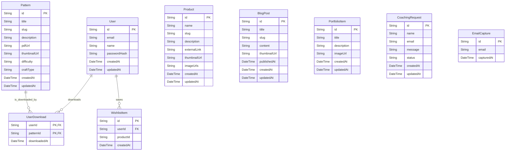

# DATABASE.md: Nureaknite

This document outlines the database schema for the Nureaknite project, detailing the entities, their attributes, relationships, and the corresponding Prisma schema.

## ERD



## Table Definitions

### User
Stores user authentication and profile information.
| Field | Type | Description |
|:---|:---|:---|
| `id` | String (PK) | Unique identifier for the user. |
| `email` | String (UK) | User's email address, used for login. Must be unique. |
| `name` | String | User's display name. |
| `passwordHash` | String | Hashed password for secure authentication. |
| `createdAt` | DateTime | Timestamp when the user account was created. |
| `updatedAt` | DateTime | Timestamp of the last update to the user account. |

### Pattern
Represents a digital knitting or crochet pattern (PDF). All patterns are free.
| Field | Type | Description |
|:---|:---|:---|
| `id` | String (PK) | Unique identifier for the pattern. |
| `title` | String | Title of the pattern. |
| `slug` | String (UK) | URL-friendly unique identifier for the pattern. |
| `description` | String | Detailed description of the pattern. |
| `pdfUrl` | String | URL to the pattern's PDF file in Supabase Storage. |
| `thumbnailUrl` | String | URL to the pattern's thumbnail image. |
| `difficulty` | Enum | Difficulty level (e.g., BEGINNER, INTERMEDIATE, ADVANCED). |
| `craftType` | Enum | Type of craft (e.g., KNITTING, CROCHET). |
| `createdAt` | DateTime | Timestamp when the pattern was created. |
| `updatedAt` | DateTime | Timestamp of the last update to the pattern. |

### Product
Represents a physical product showcased in the shop catalog (no purchase flow).
| Field | Type | Description |
|:---|:---|:---|
| `id` | String (PK) | Unique identifier for the product. |
| `name` | String | Name of the product. |
| `slug` | String (UK) | URL-friendly unique identifier for the product. |
| `description` | String | Detailed description of the product. |
| `externalLink` | String | Optional link to external purchase page (Shopee, Tokopedia, DM, etc.). |
| `thumbnailUrl` | String | URL to the product's main thumbnail image. |
| `imageUrls` | String[] | Array of URLs for additional product images. |
| `createdAt` | DateTime | Timestamp when the product was created. |
| `updatedAt` | DateTime | Timestamp of the last update to the product. |

### BlogPost
Stores content for blog articles and tutorials.
| Field | Type | Description |
|:---|:---|:---|
| `id` | String (PK) | Unique identifier for the blog post. |
| `title` | String | Title of the blog post. |
| `slug` | String (UK) | URL-friendly unique identifier for the blog post. |
| `content` | String | Full content of the blog post (e.g., Markdown or HTML). |
| `thumbnailUrl` | String | URL to the blog post's thumbnail image. |
| `publishedAt` | DateTime | Timestamp when the blog post was published. Nullable if draft. |
| `createdAt` | DateTime | Timestamp when the blog post was created. |
| `updatedAt` | DateTime | Timestamp of the last update to the blog post. |

### PortfolioItem
Showcases the creator's finished works or projects.
| Field | Type | Description |
|:---|:---|:---|
| `id` | String (PK) | Unique identifier for the portfolio item. |
| `title` | String | Title of the portfolio piece. |
| `description` | String | Description of the work. |
| `imageUrl` | String | URL to the image of the portfolio piece. |
| `createdAt` | DateTime | Timestamp when the portfolio item was created. |
| `updatedAt` | DateTime | Timestamp of the last update to the portfolio item. |

### CoachingRequest
Stores details from the one-on-one offline coaching request form.
| Field | Type | Description |
|:---|:---|:---|
| `id` | String (PK) | Unique identifier for the coaching request. |
| `name` | String | Name of the person requesting coaching. |
| `email` | String | Email address of the requester. |
| `message` | String | Message or specific request from the user. |
| `status` | Enum | Current status of the request (e.g., NEW, CONTACTED, ARCHIVED). |
| `createdAt` | DateTime | Timestamp when the request was submitted. |
| `updatedAt` | DateTime | Timestamp of the last update to the request status. |

### UserDownload
Tracks which patterns a user has downloaded.
| Field | Type | Description |
|:---|:---|:---|
| `userId` | String (PK, FK) | Foreign key referencing the `User`. Part of composite primary key. |
| `patternId` | String (PK, FK) | Foreign key referencing the `Pattern`. Part of composite primary key. |
| `downloadedAt` | DateTime | Timestamp when the pattern was downloaded by the user. |

### WishlistItem
Stores products saved by a user for future reference.
| Field | Type | Description |
|:---|:---|:---|
| `id` | String (PK) | Unique identifier for the wishlist item. |
| `userId` | String (FK) | Foreign key referencing the `User`. |
| `productId` | String | ID of the product (referencing Strapi product). |
| `createdAt` | DateTime | Timestamp when the item was saved to wishlist. |

### EmailCapture
Captures emails from pattern downloads for marketing purposes.
| Field | Type | Description |
|:---|:---|:---|
| `id` | String (PK) | Unique identifier for the email capture. |
| `email` | String | Email address submitted by the user. |
| `capturedAt` | DateTime | Timestamp when the email was captured. |

## Prisma Schema

```prisma
generator client {
  provider = "prisma-client-js"
}

datasource db {
  provider = "postgresql"
  url      = env("DATABASE_URL")
}

// Enums
enum PatternDifficulty {
  BEGINNER
  INTERMEDIATE
  ADVANCED
}

enum CraftType {
  KNITTING
  CROCHET
  BOTH
}

enum CoachingRequestStatus {
  NEW
  CONTACTED
  ARCHIVED
}

// Models
model User {
  id              String           @id @default(cuid())
  email           String           @unique
  name            String?
  passwordHash    String
  createdAt       DateTime         @default(now())
  updatedAt       DateTime         @updatedAt
  downloads       UserDownload[]
  wishlistItems   WishlistItem[]
}

model Pattern {
  id           String           @id @default(cuid())
  title        String
  slug         String           @unique
  description  String
  pdfUrl       String
  thumbnailUrl String
  difficulty   PatternDifficulty
  craftType    CraftType
  createdAt    DateTime         @default(now())
  updatedAt    DateTime         @updatedAt
  downloads    UserDownload[]
}

model Product {
  id           String   @id @default(cuid())
  name         String
  slug         String   @unique
  description  String
  externalLink String?
  thumbnailUrl String
  imageUrls    String[]
  createdAt    DateTime @default(now())
  updatedAt    DateTime @updatedAt
}

model BlogPost {
  id           String    @id @default(cuid())
  title        String
  slug         String    @unique
  content      String
  thumbnailUrl String?
  publishedAt  DateTime?
  createdAt    DateTime  @default(now())
  updatedAt    DateTime  @updatedAt
}

model PortfolioItem {
  id          String   @id @default(cuid())
  title       String
  description String?
  imageUrl    String
  createdAt   DateTime @default(now())
  updatedAt   DateTime @updatedAt
}

model CoachingRequest {
  id        String               @id @default(cuid())
  name      String
  email     String
  message   String
  status    CoachingRequestStatus @default(NEW)
  createdAt DateTime             @default(now())
  updatedAt DateTime             @updatedAt
}

model UserDownload {
  userId       String
  patternId    String
  downloadedAt DateTime @default(now())

  user    User    @relation(fields: [userId], references: [id], onDelete: Cascade)
  pattern Pattern @relation(fields: [patternId], references: [id], onDelete: Cascade)

  @@id([userId, patternId])
}

model WishlistItem {
  id        String   @id @default(cuid())
  userId    String
  productId String
  createdAt DateTime @default(now())

  user User @relation(fields: [userId], references: [id], onDelete: Cascade)

  @@unique([userId, productId])
}

model EmailCapture {
  id          String   @id @default(cuid())
  email       String
  capturedAt  DateTime @default(now())
}
```
